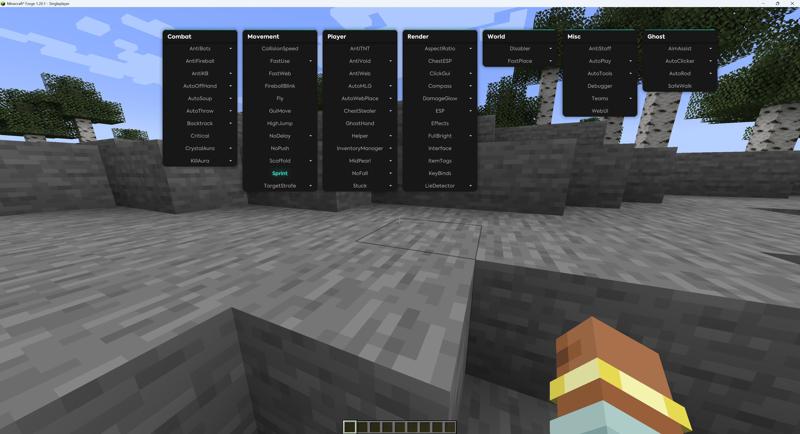
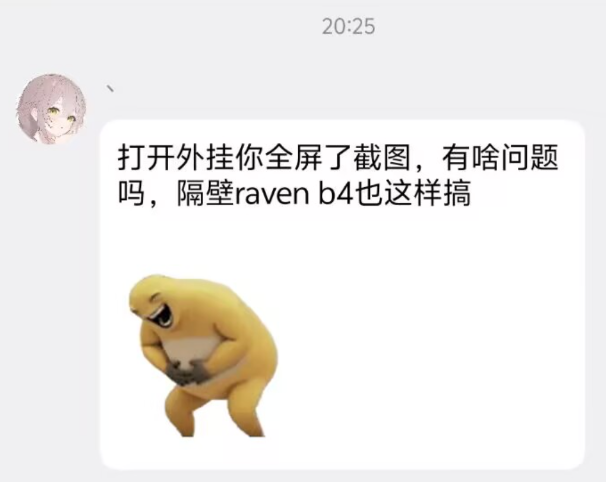
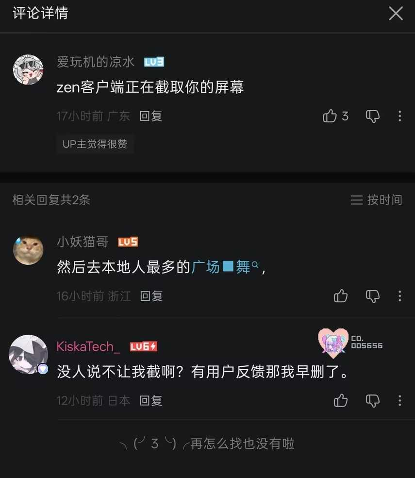
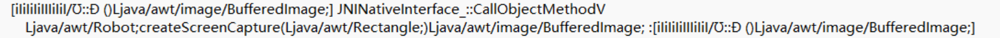
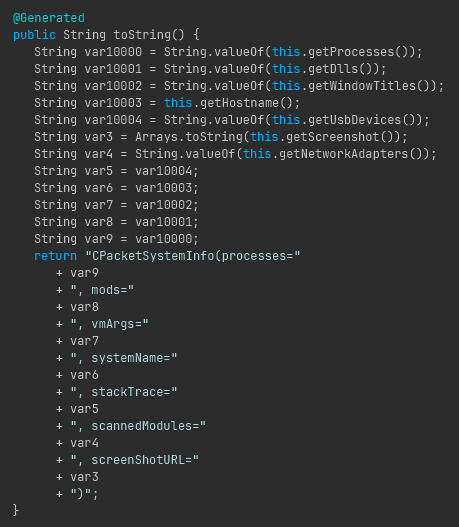
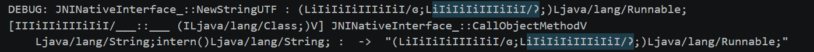
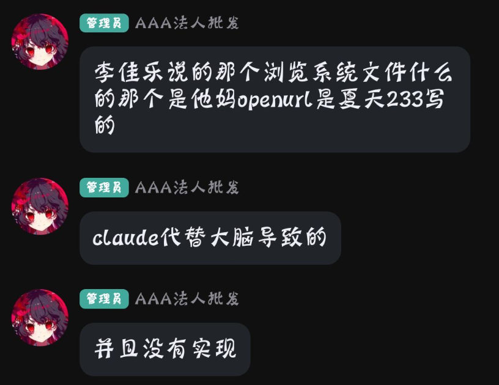
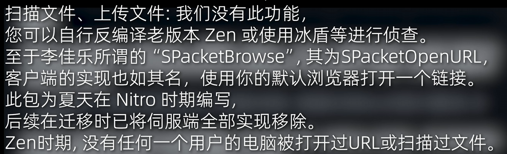
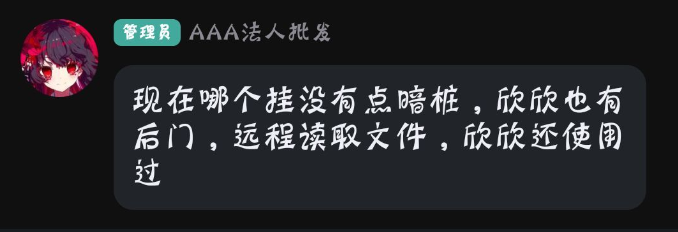

# Open Zen

> 欢迎加群 523522206 讨论该项目。

> 截止至目前，Open Zen仍然处于早期构建阶段。大量特性可能仍不可用，请谅解！当您发现有不可用的功能时，欢迎开Issues描述或直接提交Pull Request，我们将不胜感激！

**Open Zen** 是 *Zen* Minecraft 客户端的反混淆源码版本，几乎是由 [Claude](https://claude.com/)协助逆向得到。目标版本为 **Minecraft 1.20.1 + Forge 47.4.20**。

原始 Jar 经过完整混淆：类/字段/方法重命名、控制流扁平化。我使用Opus 4.7对其进行了反混淆，并结合 [Enigma MCP](https://github.com/Margele/Enigma-MCP)和Sonnet 4.6对其的类/字段/方法重命名进行猜测，最后将其还原为了可读的 Java。最终产物是一个可以直接用 Gradle 构建的工程，而不是一个二进制 blob。

> ⚠️ 本仓库**仅供学习与研究目的发布** —— 用于研究客户端侧游戏改造、ASM 字节码补丁和混淆/反混淆技术。在你不拥有的服务器上使用作弊客户端违反绝大多数服务器规则，请自行承担后果。

## 许可
原始混淆字节码未授予任何许可。本仓库中的反混淆产物、构建脚本与文档**仅供研究与学习使用**。如果你是 Zen 的原作者并希望本仓库下架或重新授权，请提 Issues。虽然提了也不会搭理你。

## 截图


## 后门
我们在逆向时发现原版Zen存在大量后门，例如上报QQ、屏幕截图、扫描文件、上传文件、远程执行命令等。因此我们**不推荐**任何用户继续使用原版Zen，除非你愿意现在把你身上的衣服脱掉然后去本地人最多的广场裸舞，然后把自己裸舞的视频发送到Zen的群内。

当Zen被注入后，会自动触发截图并上传至服务器。精神马来西亚人回应如下：



由于精神马来西亚人从小父母双亡，无父无母的精神马来西亚人自幼脑回路不正常。他认为虽然自己没有说自己的外挂会截图，但是由于自己截图，并没有遭到用户反对，所以所以用户都心甘情愿被截图**全屏**并上传到其服务器上。当然不排除所有Zen客户端用户都喜欢把身上的衣服脱掉然后去本地人最多的广场裸舞的可能性。



### 分析
当Zen启动时，会自动调用 `iIiIiIiIIIiIiI/Ʊ Đ()Ljava/awt/image/BufferedImage` ([Mapping](./mapping/zen.mapping#L140))，可能由于精神马来西亚人自知是后门，因此精神马来西亚人将此方法严防死守，惨遭没有逼卵子用的Native混淆。

以下是对该方法的Trace。



可见，此方法调用了 `java/awt/Robot;createScreenCapture(Ljava/awt/Rectangle)`，会将用户的**全屏**截图后返回。

继续向下追踪，发现其新建了 `iIiIiIiIIIiIiI/ɿ` (`CPacketSystemInfo`) ([Mapping](./mapping/zen.mapping#L2552)) 对象，我们对该类反编译，发现精神马来西亚人妈妈死掉了所以忘记删除Lombok自动生成的`@ToString`方法，因此惨遭Claude还原。



此包会上传用户处理器信息、模组列表、虚拟机参数、系统名称、上报截图等信息，但笔者认为除截图外，其他信息收集在**提前告知用户的前提下**是合理的，因此并无不妥。虽然精神马来西亚人没有提前告知用户。

随后，笔者继续分析。由于该类继承了 `iIiIiIiIIIiIiI/ɰ` (`Packet`) ([Mapping](./mapping/zen.mapping#L2459))，我们分析了所有该类的子类。

遗憾的，其他类由于没有添加Lombok标识，我们我们不得不通过其他方式Trace这些类的具体用途。经过我们不懈努力的调试和追踪，我们还原出了我们认为可疑的部分行为。

- 远程命令执行 `iIiIiIiIIIiIiI/ʔ`
- 远程文件下发 `iIiIiIiIIIiIiI/ʏ`
- 远程文件浏览 `iIiIiIiIIIiIiI/ʑ`

*以上不是全部*



对于这些后门，精神马来西亚人作此解释。



精神马来西亚人称这些后门全部都是由**夏天233**制造，并非自己。并且这些后门并没有实现，所以可能是由于精神马来西亚人产生幻觉导致笔者抓到了Trace。而且并不能解释同是一套Network系统，为什么上传截图包实现了但其他方法没有实现。

其后其在[视频](https://www.bilibili.com/video/BV147L86TEEZ)中表示，是服务器在迁移时没有实现，而不是客户端没有实现。同时，精神马来西亚人在视频中表示*没有功能*，但是在QQ群中表示*是夏天233写的*。



由于精神马来西亚人嘴硬，所以到底具体有没有实现，笔者暂且蒙古。

### 父子相爱相杀
精神马来西亚人在QQ群中指出，欣欣使用过外挂后门远程读取他人文件。不知作为德州骡子的许锦良见自己的亲生父亲如此指认自己作何感想。



## 原始 Jar + Mapping
[原始Jar](./mapping/zen-orignial.jar)
[Mapping](./mapping/zen.mapping)

需要说明的是，部分喜欢裸舞的忠实Zen用户认为本源码逆向自比较旧的Zen版本。可能是因为这部分用户的脑容量只允许自己导入其他配置，因此不认识Zen的老旧UI。因此必须要说明，此源码使用的原始Jar截止至2026年5月21日是最新的。

## 细节
经过Opus 4.7长达18秒的分析，Opus认为所有的类由惨遭魔改的Zelix KlassMaster混淆。除了Zelix的Invoke Dynamic和String Encryption外，还有部分未参与任何计算的Interger \ Long变量花指令代码和仅在部分方法中出现的Flow混淆。

其中大部分类都可以经过小修小补的现有Zelix反混淆器完成，关键部分的`cinit`被Native保护，导致在Java层中没有对应的Master Key可以对Invoke Dynamic和String反混淆。但可能由于精神马来西亚人的脑袋在马来西亚骑摩托被其他车创飞导致脑溢血，即使你没有通过客户端认证也可以完整加载Native并对Class进行注册。因此我们完整的还原了所有类的Invoke Dynamic和String混淆。

其他的混淆经过Opus长达30秒的分析，顺利写出了反混淆器。 但被Rename后的代码几乎不可读，因此我用Opus 4.7制作了[Enigma MCP](https://github.com/Margele/Enigma-MCP)，接入Sonnet 4.6对其参照部分客户端进行了反混淆。

再使用Opus 4.7对本项目经过长达6小时的修复和少量的人工修复，便得到了这份源码。

## 抄袭
此项目大部分功能模块几乎全部抄袭自Naven客户端，具体详见以下分析。

[详细分析](./paste/README.md)

## 状态与注意事项
- 这是**尽力而为的反混淆结果**，部分符号是根据上下文重建的，可能与原作者的命名意图不一致。

## 构建

OpenZen 现在使用 Forge + Sponge Mixin 加载，不再需要 Java Agent、DLL 或外部注入器。

### 共同前置

- **JDK 17**（推荐 Microsoft Build of OpenJDK / Temurin / Azul Zulu 任一）。
- 必须设置 `JAVA_HOME` 环境变量指向该 JDK 安装目录（PowerShell 验证：`echo $env:JAVA_HOME`）。
- 仓库根目录用 `gradlew.bat` 即可，**不需要**单独安装 Gradle。

首次执行会从 ForgeMaven 下载 1.20.1 + Forge 47.4.20 的 mappings 和依赖，耗时几分钟到十几分钟，取决于网络。

### 构建 Forge Mod jar

```powershell
.\gradlew.bat jar
```

产物：`build/libs/hey-1.0.jar`。

### 开发环境运行

```powershell
.\gradlew.bat runClient
```

Mixin 配置文件为 `src/main/resources/hey.mixins.json`，构建时会生成并打包 `hey.refmap.json`。

## 常见问题

### 布吉岛反作弊绕过
~~截止至目前（2026/05/23)，布吉岛并未检测本项目，考虑其反作弊为黑名单类名机制。~~
~~建议构建时修改类名。~~
类名已黑名单，请在构建时修改类名。

## 致谢

- 原始混淆客户端：**Zen**。
- 反混淆、符号还原与工程脚手架：**Claude** 在人工监督下完成。
- [Java Deobfuscator](https://github.com/java-deobfuscator/deobfuscator)
- 从古墓中挖出的 [Themida](https://www.oreans.com/Themida.php)
- 惨遭魔改的 [Zelix](https://www.zelix.com/)
- [Enigma MCP](https://github.com/Margele/Enigma-MCP)
